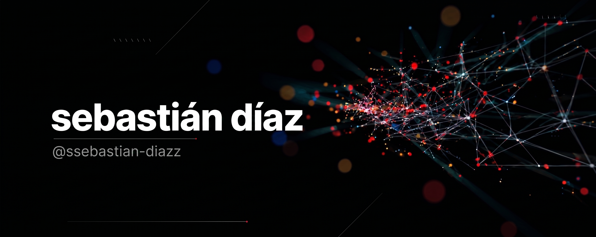
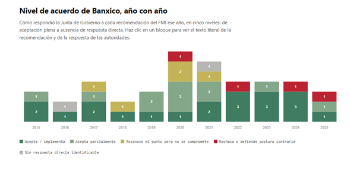
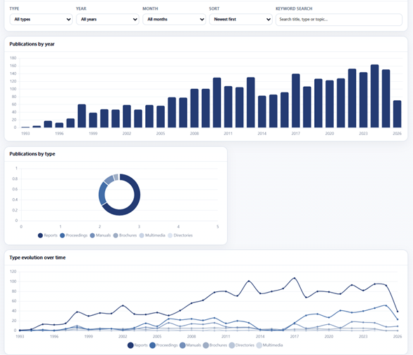
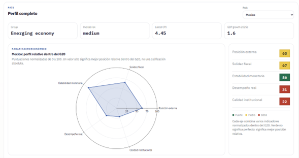
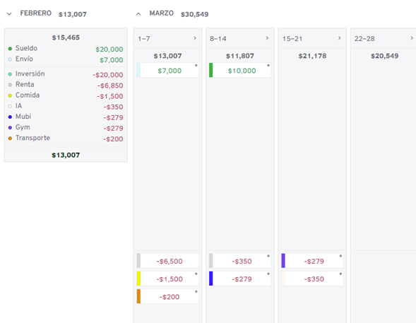
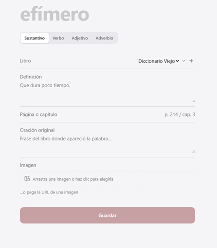

	

	
	

 

## About Me

**Economics** graduate from **UNAM** working at the intersection of economics, financial data, and data engineering. Currently completing my internship at **Banco de México's** *División de Asuntos Internacionales*.

I build data-driven projects that turn complex and unstructured information into useful tools and analysis. My work includes ETL pipelines, web scraping, financial apps, and the integration of AI into practical applications.
 

## Tech Stack

### Languages & Data

&nbsp;
&nbsp;
&nbsp;
&nbsp;

### Frontend & Backend

&nbsp;
&nbsp;
&nbsp;
&nbsp;

### Data & Analysis

&nbsp;
&nbsp;

### Tools

&nbsp;
&nbsp;

	

## Banco de México — Work & Projects

At Banxico's División de Asuntos Internacionales, I support analysis on international monetary policy and build tooling to make that analysis reproducible.

### [Monetary Policy Analysis: IMF Article IV Recommendations to Mexico, 2015–2025](https://github.com/ssebastian-diazz/Article-IV)
> NLP pipeline parsing a decade of IMF Article IV consultations, extracting and classifying recommendations, published as an interactive dashboard.
- **Tech**: Python, NLP, GitHub Pages, SVG data visualization

	

### [APEC Publications Explorer](https://github.com/ssebastian-diazz/APEC_publications)
> Scraping and cleaning pipeline over APEC's public publications archive (1993–2026, 2,883 of 2,919 records recovered), published as an interactive dashboard with volume, type, and title-term analysis over time.
- **Tech**: Python, Node.js, JavaScript, Chart.js

	

### [G20 Macro Dashboard](https://github.com/ssebastian-diazz/G20-Macro-Analysis)
> Comparative macroeconomic, external, and institutional dashboard across G20 economies (2024–2025e), with country profiles, cross-indicator relationships, and a vulnerability heatmap.
- **Tech**: JavaScript, Plotly.js

	

## Personal Projects

### [FinTrack](https://github.com/ssebastian-diazz/FinTrack)
> A personal finance app built to track and reason about my own spending, and plan future expenses.
- **Tech**: React, Vite, TypeScript, Tailwind

	

### [Diccionario](https://github.com/ssebastian-diazz/Diccionario)
> A personal vocabulary capture app, rebuilt from a dictionary system I first put together in secondary school. Built around an active reading-session flow and a printed-dictionary editorial aesthetic.
- **Tech**: React, Vite, TypeScript, Tailwind, Supabase

	

## Background

- **Economics** — B.A. in Economics, UNAM

## Interests

Linguistics, literature, urbanism, film — and building small tools to think more carefully about what I read and watch, rather than consuming passively.

Reach out: <a href="mailto:sebastiaan.diaz.prado@gmail.com">sebastiaan.diaz.prado@gmail.com</a>

